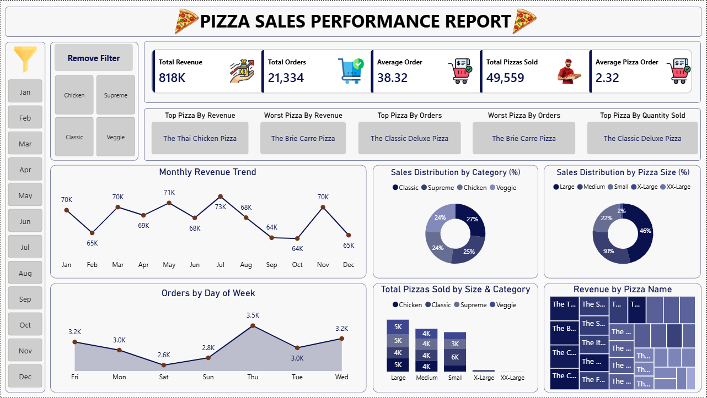

# 🍕 Pizza Sales Performance Analysis

## 📌 Project Overview

This project analyzes pizza sales data using PostgreSQL and Power BI to uncover valuable business insights related to revenue, customer ordering behavior, product performance, and sales trends.

The dashboard helps stakeholders monitor key business metrics, identify top-performing products, and make data-driven decisions to improve sales performance.

---

# 🎯 Business Problem

A pizza business generates thousands of transactions throughout the year. Without proper reporting and analysis, it becomes difficult to:

* Track revenue performance
* Monitor customer ordering patterns
* Identify top and low-performing products
* Analyze category-wise and size-wise sales
* Understand seasonal sales trends

This project provides an end-to-end analytics solution using SQL and Power BI.

---

# 🛠 Tools & Technologies Used

* PostgreSQL
* SQL
* Power BI
* Power Query
* DAX
* Data Visualization

---

# 📂 Dataset Information

The dataset contains pizza sales transaction data with the following fields:

| Column         | Description             |
| -------------- | ----------------------- |
| Order ID       | Unique Order Identifier |
| Order Date     | Date of Order           |
| Order Time     | Time of Order           |
| Pizza Name     | Product Name            |
| Pizza Category | Pizza Category          |
| Pizza Size     | Pizza Size              |
| Quantity       | Number of Pizzas Sold   |
| Unit Price     | Price per Pizza         |
| Total Price    | Total Order Value       |

---

# 🧹 Data Preparation

### Data Cleaning

* Verified data quality
* Checked for missing values
* Validated data types
* Standardized date formats

### SQL Analysis

Used SQL for:

* Revenue Analysis
* Sales Trend Analysis
* Product Performance Analysis
* Customer Order Analysis
* Category Analysis

---

# 📊 KPI Metrics

The dashboard tracks:

| KPI                      | Value  |
| ------------------------ | ------ |
| Total Revenue            | $818K  |
| Total Orders             | 21,334 |
| Average Order Value      | $38.32 |
| Total Pizzas Sold        | 49,559 |
| Average Pizzas Per Order | 2.32   |

---

# 📈 Dashboard Analysis

## Revenue Analysis

* Monthly Revenue Trend
* Revenue by Pizza Name
* Top Pizza by Revenue
* Worst Pizza by Revenue

## Order Analysis

* Orders by Day of Week
* Top Pizza by Orders
* Worst Pizza by Orders

## Product Analysis

* Sales Distribution by Category
* Sales Distribution by Pizza Size
* Quantity Sold by Category and Size

---

# 🔍 SQL Business Questions Solved

### Sales Performance

* Total Revenue Generated
* Total Orders Placed
* Average Order Value
* Total Quantity Sold

### Product Performance

* Top Performing Pizza by Revenue
* Lowest Performing Pizza by Revenue
* Top Pizza by Orders
* Top Pizza by Quantity Sold

### Trend Analysis

* Monthly Revenue Trends
* Day-wise Order Analysis
* Category-wise Sales Performance
* Size-wise Sales Distribution

---

# 💡 Key Insights

* The Thai Chicken Pizza generated the highest revenue.
* The Classic Deluxe Pizza received the highest number of orders.
* Large-sized pizzas contributed the highest share of total sales.
* Revenue fluctuated across months, indicating seasonal demand patterns.
* Sales distribution was balanced across Classic, Supreme, Chicken, and Veggie categories.

---

# 🖼 Dashboard Preview



---

# 📁 Project Structure

```text
Pizza-Sales-Analysis
│
├── Dataset
│   └── pizza_sales.csv
│
├── SQL
│   └── ALL Queries.sql
│
├── Screenshots
│   └── Dashboard.png
│
├── Pizza_Sales_Dashboard.pbix
│
└── README.md
```

---

# 🚀 How To Run

### Step 1

Import the dataset into PostgreSQL.

### Step 2

Execute the SQL queries from:

```text
ALL Queries.sql
```

### Step 3

Connect PostgreSQL with Power BI.

### Step 4

Create data model and measures.

### Step 5

Build dashboard visualizations.

### Step 6

Analyze business performance using interactive filters.

---

# 🎓 Skills Demonstrated

* SQL Query Writing
* PostgreSQL
* Power BI
* Power Query
* DAX
* Data Cleaning
* Data Modeling
* Exploratory Data Analysis (EDA)
* KPI Development
* Dashboard Design
* Business Intelligence
* Data Visualization

---

# 👨‍💻 Author

### Navneet Prajapati

Data Analyst | Business Analyst | Reporting & MIS Analyst | Power BI Developer